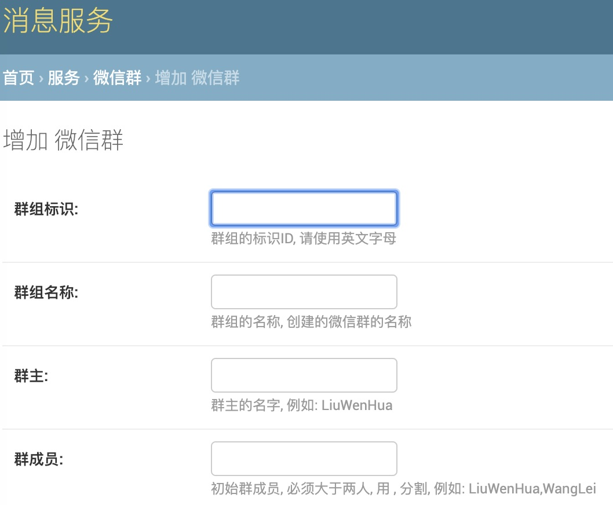
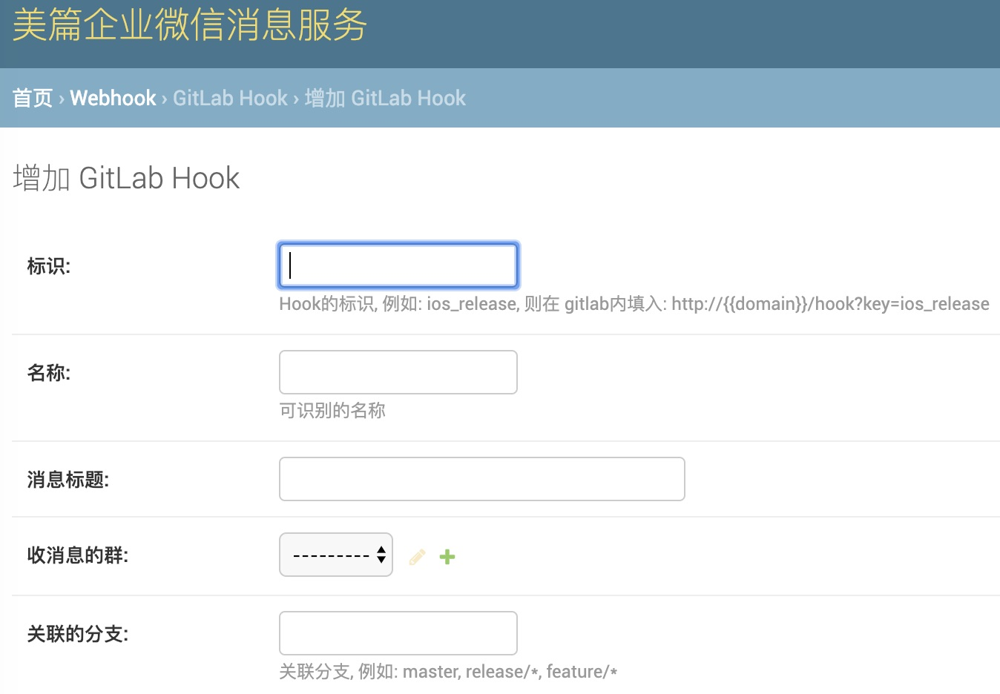
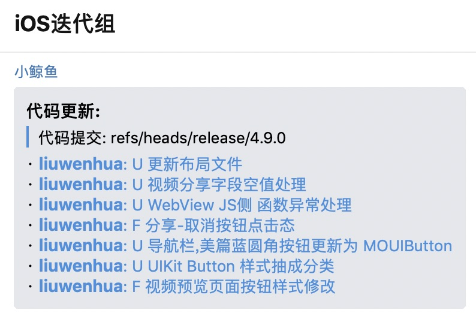

## 企业微信消息服务


### 企业微信群组创建

创建企业微信群需要填写:

* 群组标识
* 群组名称
* 群主
* 群成员: 必须大于2人 

如果群组标识对应的群组已经存在, 则群创建失败

创建成功后, 会默认发送一条群消息, 让群聊在终端用户可见  

群创建成功后, 可以在终端进行群成员管理.
  
示例图:  


### Git WebHook消息转发到微信群

gitlab 的 webhook 触发时, 会触发调用对应的接口.
接口收到消息后, 会对消息进行处理, 在发送消息到微信群.

先创建WebHook配置, 需要填写:

* 配置的标识 
* 收消息的群组
* 该配置的名称
* 过滤的分支

例如:

标识为: `test_ios`
过滤的分支为: `ref/head/master`
收消息的群组为: `ios消息群`

则在gitlab里面配置的 hook url 为: 

```
http://{domain}/hook?key=test_ios
```

仅在master分支有push时, 才会有消息转发到 `ios消息群`

示例图:   


Webhook消息已markdown格式展示, 如不展示, 需升级企业微信终端版本

示例图:  


