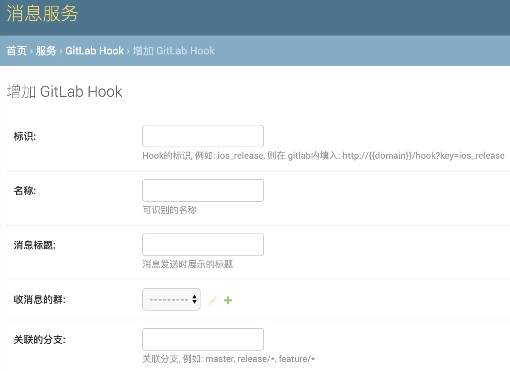

## 企业微信消息服务

利用该服务可以创建企业微信群组, 并在群组内发布应用消息.    
集成了WebHook能力, 可以接收WebHook消息, 并将消息转发的微信群组内.


### 服务安装方法

项目使用 Python2/3 + Django + Sqlite数据库.
服务部署需参照django的部署流程.


### 配置

1. 在企业微信后天创建应用, 指定`应用的部门为根部分`
2. 登陆服务后台, 在Config应用内配置`企业微信的corpid`和应用的`secret`

服务提供三个配置项:

|name|key|value|
|:----|:----|:----|
|站点名|cfg_site_name|给你自定义|
|企业微信CorpId|cfg_ewx_corp_id|按指定填写|
|应用Secret|cfg_ewx_corp_secret|按指定填写|


### 创建微信群

> 注意: 企业微信API要求, 必须使用API创建的群组才能发送应用消息

创建企业微信群需要填写:

* 群组标识
* 群组名称
* 群主
* 群成员: 必须大于2人 

如果群组标识对应的群组已经存在, 则群创建失败  
创建成功后, 会默认发送一条群消息, 让群聊在终端用户可见    
群创建成功后, 可以在终端进行群成员管理.  
  
示例图:  


### GitLab WebHook 集成

> 如果要集成gitlab接收到推送时, 发送消息到群内, 提醒群成员, 可以使用该功能

```
graph LR
git_push --> gitlab
gitlab -- webhook --> 本消息服务
本消息服务 -- send msg --> 企业微信群
```

先创建WebHook配置, 需要填写:

* 配置的标识 
* 收消息的群组
* 该配置的名称
* 过滤的分支

例如:

标识为: `test`  
过滤的分支为: `master`  
收消息的群组为: `迭代群`  

则在gitlab里面配置的 hook url 为: 


```
http://{domain}/hook?key=test
```

仅在master分支有push时, 才会有消息转发到 `迭代群`

示例图:   


Webhook消息已markdown格式展示, 如不展示, 需升级企业微信终端版本

示例图:  


### 附件

* [企业微信API](https://work.weixin.qq.com/api/doc#90000/90135/90243)
